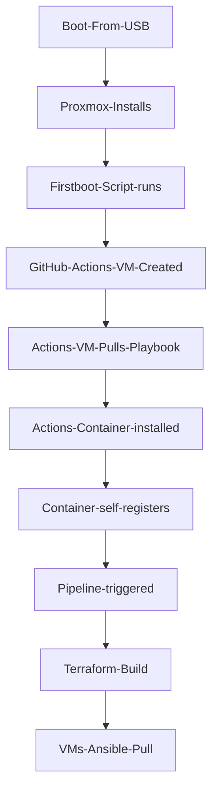

       

# All-In-One Home Server Automation
Here you'll find automation from the baremetal proxmox install to the Kubernetes ConfigMaps.

## Goal
To automate the installation and configuration of my home infrastructure. This is a complete solution, from a blank bare metal state to a fully function Proxmox install including self hosted GitHub Actions runners, Kubernetes clusters, OpenWRT routers and more. The only manual step is plugging the two USB drives into the target server.
## Components
- [Auto-Install](https://github.com/tekore/HomeOps/tree/main/Auto-Install)
- [Ansible](https://github.com/tekore/HomeOps/tree/main/Ansible)
- [Terraform](https://github.com/tekore/HomeOps/tree/main/Terraform)

## Technical Overview


## Common Pitfalls
- When installing the GitHub runner, if the GitHub token is more than an hour old it will be expired. This will prevent the container from registering itself with GitHub. To 're-do' this step, update the file on the GitHub runner Virtual machine in '/tmp/runner_secrets.yml', killoff the old container and then pull the playbook again
```sh
docker stop github-runner
docker rm github-runner
ansible-pull -U $ANSIBLE_REPO_URL -i localhost --purge $ANSIBLE_REPO_PLAYBOOK --extra-vars "@/tmp/runner_secrets.yml"
```
###### Note: These variables are defined in the first-boot-script.sh, for me the values are "https://github.com/tekore/HomeOps.git" and "Ansible/configure-runner.yml"

## Maintainers
[@Tekore](https://github.com/tekore)
